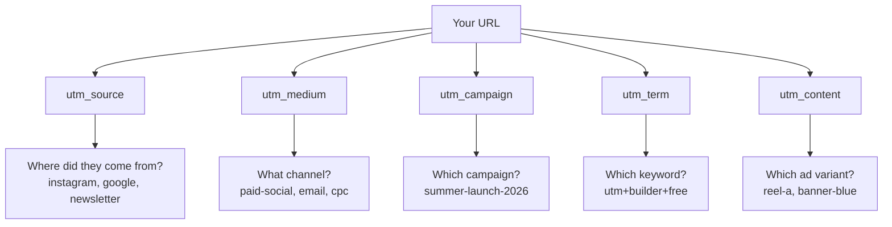
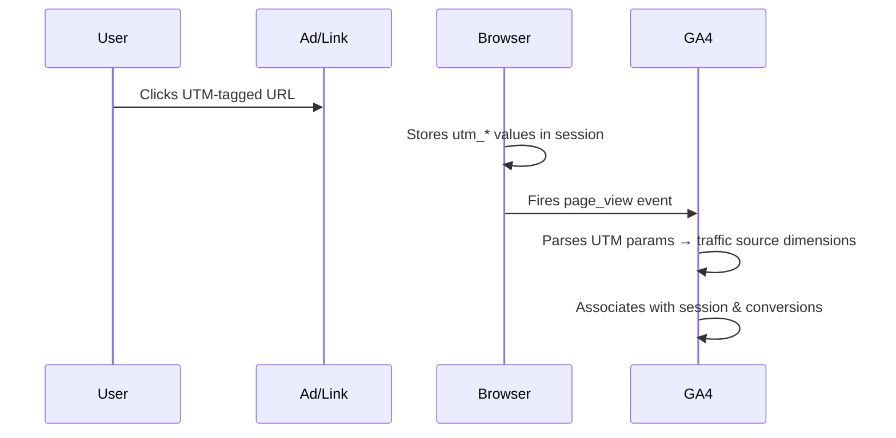
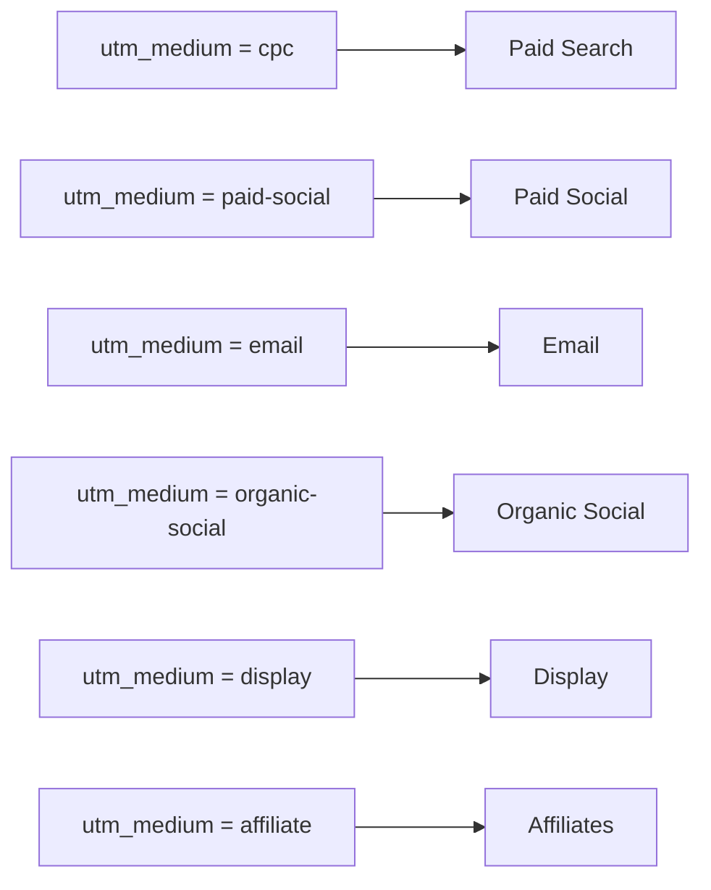

# UTM Parameters: The Complete Guide (2026)

**Subtitle:** Everything you need to know about UTM tracking — what the parameters do, how to build them correctly, real campaign examples, and the exact mistakes that break your analytics.

| | |
|---|---|
| ⏱ Reading time | 12 minutes |
| 📅 Last Updated | June 2026 |
| 🎯 Difficulty | Beginner–Intermediate |
| 🔗 Tool | [Free UTM Builder →](https://marketertools.fyi/utm-builder) |

---

## Keyword Research

| Metric | Value |
|---|---|
| **Primary Keyword** | utm parameters |
| **Search Intent** | Informational |
| **Monthly Search Volume** | ~40,000 (US) |
| **Keyword Difficulty** | 32 |
| **CPC** | $4.20 |
| **Top Ranking Competitors** | HubSpot, Shopify, Agency Analytics, Ortto |
| **Secondary Keywords** | utm tracking, utm codes, utm links, utm builder, utm campaign parameters |
| **Long-tail Keywords** | "what are utm parameters", "how to use utm parameters", "utm parameters google analytics 4", "utm parameters best practices", "utm parameter examples" |
| **Related Questions** | How do UTM parameters work? Do UTM parameters affect SEO? What are the 5 UTM parameters? What is utm_source? |
| **Semantic Keywords** | campaign tracking, marketing attribution, URL parameters, Google Analytics, tracking URLs, campaign URLs, source medium campaign |
| **PAA Queries** | What does UTM stand for? What are UTM parameters used for? Do UTM parameters hurt SEO? How do I add UTM parameters to a URL? |
| **AI Search Questions** | "explain utm parameters simply", "utm parameters vs regular URLs", "how to track marketing campaigns with UTM" |

---

## Table of Contents

1. [Quick Answer](#quick-answer)
2. [What Are UTM Parameters?](#what-are-utm-parameters)
3. [The 5 UTM Parameters Explained](#the-5-utm-parameters-explained)
4. [How UTM Tracking Works](#how-utm-tracking-works)
5. [Building UTM URLs: Step-by-Step](#building-utm-urls)
6. [UTM Parameter Best Practices](#best-practices)
7. [Real Campaign Examples](#real-examples)
8. [Common Mistakes](#common-mistakes)
9. [UTM Parameters in GA4](#ga4)
10. [Pro Tips & Advanced Usage](#pro-tips)
11. [FAQs](#faqs)
12. [Schema Markup](#schema)

---

## Quick Answer {#quick-answer}

> **What are UTM parameters?**
> UTM parameters are short tags added to the end of a URL that tell Google Analytics (or any analytics tool) where your traffic came from. There are five standard parameters: `utm_source`, `utm_medium`, `utm_campaign`, `utm_term`, and `utm_content`. Only `utm_source` is required. They do not affect SEO.

*Optimized for: Google Featured Snippets · AI Overviews · ChatGPT · Perplexity*

---

## What Are UTM Parameters? {#what-are-utm-parameters}

UTM stands for **Urchin Tracking Module** — named after Urchin Software, the web analytics company Google acquired in 2005 that became the foundation of Google Analytics.

At their simplest, UTM parameters are pieces of text you attach to the end of a URL. When someone clicks that URL, the parameters get sent to your analytics platform, which records exactly where the visitor came from and what campaign drove them there.

**Without UTM parameters:**
Your analytics dashboard shows you 2,400 sessions from "Social" — but you don't know if they came from a paid Instagram campaign, an organic LinkedIn post, or a tweet that went semi-viral.

**With UTM parameters:**
You see exactly 940 sessions from your Instagram Reels campaign "summer-launch," 1,100 from your LinkedIn newsletter, and 360 from a Twitter thread — each tracked independently with conversion data attached.

That difference is the entire business case for UTM tracking.

```
https://marketertools.fyi/utm-builder
    ?utm_source=instagram
    &utm_medium=paid-social
    &utm_campaign=summer-launch-2026
    &utm_content=reel-variant-a
```

---

## The 5 UTM Parameters Explained {#the-5-utm-parameters-explained}



### 1. `utm_source` — Required

**What it answers:** *Which platform sent this traffic?*

This identifies the publisher, website, or origin of the traffic. Think of it as the "referring entity."

| Source Example | Use Case |
|---|---|
| `instagram` | Traffic from Instagram |
| `google` | Google paid or organic |
| `newsletter` | Your email newsletter |
| `linkedin` | LinkedIn posts or ads |
| `tiktok` | TikTok content or ads |
| `partner-site` | An affiliate or partner |

**Rule:** Always lowercase. Never use spaces — use hyphens.

---

### 2. `utm_medium` — Strongly Recommended

**What it answers:** *What type of marketing channel?*

This is the marketing vehicle or channel type. It sits above `utm_source` in the hierarchy.

| Medium | Channel Description |
|---|---|
| `cpc` | Cost-per-click paid search |
| `paid-social` | Paid social media ads |
| `email` | Email campaigns |
| `organic-social` | Unpaid social posts |
| `display` | Display/banner ads |
| `affiliate` | Affiliate marketing |
| `referral` | Referral links |
| `sms` | Text message campaigns |

> 💡 **Pro Tip:** `utm_medium` maps directly to GA4's "Session default channel group." Use `email` (not `emails` or `Email`) to avoid fragmented data in your reports.

---

### 3. `utm_campaign` — Strongly Recommended

**What it answers:** *Which specific campaign or promotion?*

This is your campaign identifier. Keep it consistent across all assets within the same campaign.

**Good examples:**
- `summer-launch-2026`
- `black-friday-retargeting`
- `q2-brand-awareness`
- `webinar-june-productdemo`

**Bad examples:**
- `Campaign 1` (spaces break URLs)
- `SUMMER` (inconsistent casing causes splitting in reports)
- `test` (meaningless in reports 6 months later)

---

### 4. `utm_term` — Optional (Paid Search)

**What it answers:** *Which keyword triggered the ad?*

Used almost exclusively for **paid search campaigns** to identify the keyword that triggered your ad. Google Ads can auto-populate this with `{keyword}` dynamic insertion.

```
?utm_term=utm+builder+free
```

For non-search campaigns, most teams skip this parameter or leave it blank.

---

### 5. `utm_content` — Optional (A/B Testing)

**What it answers:** *Which specific ad, link, or creative?*

Used to differentiate between multiple ads within the same campaign — useful for A/B testing creatives, CTAs, or link placements.

| utm_content Example | What It Tracks |
|---|---|
| `banner-blue-300x250` | Specific banner ad variant |
| `cta-get-started` | A specific CTA button |
| `link-footer` vs `link-header` | Same campaign, different link positions in an email |
| `video-15s` vs `video-30s` | Two video ad lengths |

---

## How UTM Tracking Works {#how-utm-tracking-works}



When a user clicks a UTM-tagged URL:

1. Their browser follows the full URL including the `?utm_*` parameters
2. Google Analytics 4 reads the parameter values from the URL
3. GA4 stores them as session-scoped dimensions: `session_source`, `session_medium`, `session_campaign`
4. All subsequent events in that session are attributed to that source/medium/campaign
5. When a conversion fires, GA4 credits it to the correct campaign

**One critical behavior:** The UTM parameters in the URL override any automatic attribution. If someone already has a Google Ads click attributed, but then you send them an email with UTM tags that they click, the email UTM overwrites the previous attribution for that session.

---

## Building UTM URLs: Step-by-Step {#building-utm-urls}

### Method 1: Use a UTM Builder (Recommended)

The fastest and most consistent approach. Our [free UTM Builder](https://marketertools.fyi/utm-builder) handles encoding, casing normalization, and generates URLs for both web and app campaigns (including Google Play Store referrer parameters).

**Steps:**
1. Enter your destination URL
2. Fill in `utm_source`, `utm_medium`, `utm_campaign`
3. Add optional `utm_content` and `utm_term` if needed
4. Copy the generated URL

### Method 2: Build Manually

Structure: `[base URL]?utm_source=[value]&utm_medium=[value]&utm_campaign=[value]`

```
https://example.com/pricing
  ?utm_source=instagram
  &utm_medium=paid-social
  &utm_campaign=q2-retargeting-2026
  &utm_content=carousel-variant-b
```

**Manual encoding rules:**
- Replace spaces with `+` or `%20`
- All values should be lowercase
- Use hyphens (`-`) as word separators, not underscores or spaces

> ⚠️ **Common Mistake:** Many teams use a spreadsheet to build UTMs manually. This works but introduces inconsistencies — different people spell sources differently (`instagram` vs `Instagram` vs `insta`) and GA4 treats these as 3 separate sources. A UTM builder enforces consistency.

---

## UTM Parameter Best Practices {#best-practices}

### ✅ The UTM Naming Checklist

- [ ] Always lowercase — `google` not `Google`
- [ ] Hyphens between words — `paid-social` not `paid social` or `paid_social`
- [ ] Consistent source names across all campaigns — set a "source vocabulary" document
- [ ] Tag every link in paid campaigns — missing one breaks your attribution
- [ ] Don't use UTMs on internal links — this resets the session source and breaks attribution
- [ ] Use a URL shortener after building UTM URLs for sharing — long UTM URLs look suspicious in social posts
- [ ] Test your URLs before launch — click through and verify in GA4 DebugView
- [ ] Document your naming convention — save presets so the whole team uses the same values

### The Standard Medium Vocabulary

Use this exact vocabulary across your team to prevent fragmented data:

| Channel | Correct `utm_medium` |
|---|---|
| Paid Search | `cpc` |
| Paid Social | `paid-social` |
| Email | `email` |
| Organic Social | `organic-social` |
| Display Advertising | `display` |
| Affiliate | `affiliate` |
| SMS | `sms` |
| Push Notifications | `push` |
| Podcast | `podcast` |
| Referral | `referral` |

---

## Real Campaign Examples {#real-examples}

### Example 1: Instagram Paid Campaign

**Scenario:** Driving traffic to a product launch landing page from Instagram Reels ads, A/B testing two creative variants.

```
Variant A (lifestyle video):
https://marketertools.fyi/?utm_source=instagram&utm_medium=paid-social&utm_campaign=product-launch-june26&utm_content=reels-lifestyle-15s

Variant B (product demo):
https://marketertools.fyi/?utm_source=instagram&utm_medium=paid-social&utm_campaign=product-launch-june26&utm_content=reels-demo-30s
```

**What this tells you in GA4:** Which creative drove more sessions, and which one converted at a higher rate.

---

### Example 2: Email Newsletter

**Scenario:** Weekly newsletter with 3 different links to the same article — one in the header, one inline, one in the footer.

```
Header link:
https://marketertools.fyi/blog/utm-guide?utm_source=newsletter&utm_medium=email&utm_campaign=weekly-jun-week3&utm_content=link-header

Inline link:
...utm_content=link-inline

Footer link:
...utm_content=link-footer
```

**What this tells you:** Which placement within your email drives the most clicks. Consistently, inline links outperform header and footer.

---

### Example 3: Google Ads with Auto-Tagging Disabled

**Scenario:** When GCLID auto-tagging isn't working with your CRM, manual UTM tagging is the fallback.

```
https://marketertools.fyi/utm-builder
  ?utm_source=google
  &utm_medium=cpc
  &utm_campaign=brand-exact-june26
  &utm_term={keyword}
  &utm_content={creative}
```

`{keyword}` and `{creative}` are Google Ads dynamic parameters that auto-populate with the actual triggered keyword and ad ID.

---

### Example 4: Influencer Campaign

**Scenario:** 3 influencers promoting the same product, each gets a unique link.

```
Influencer A:
?utm_source=influencer-janedoe&utm_medium=organic-social&utm_campaign=collab-june26

Influencer B:
?utm_source=influencer-marksmith&utm_medium=organic-social&utm_campaign=collab-june26
```

**Alternative approach:** Use the URL Shortener to create unique short URLs for each influencer (cleaner for sharing), then track full UTM data behind the short link.

---

## Common Mistakes {#common-mistakes}

### ⚠️ The 8 UTM Mistakes That Break Your Analytics

| Mistake | Impact | Fix |
|---|---|---|
| **Inconsistent casing** (`Google` vs `google`) | Creates duplicate sources in GA4 | Always lowercase |
| **Spaces in values** (`paid social`) | URL breaks or shows as `%20` in reports | Use hyphens: `paid-social` |
| **UTMs on internal links** | Resets session source mid-journey | Never UTM-tag same-domain links |
| **Missing `utm_medium`** | Traffic appears as "(not set)" | Always include source + medium |
| **No URL shortening** | Long UTM URLs get truncated on social | Use URL Shortener after building |
| **Not tagging all assets** | Partial campaign data — misleading ROI | Tag every paid link |
| **Same UTM across A/B variants** | Can't tell which creative performed | Unique `utm_content` per variant |
| **Tagging organic social posts inconsistently** | Social traffic mixed in organic | Decide: always tag or never tag organic |

---

## UTM Parameters in GA4 {#ga4}

In Google Analytics 4, UTM parameters map to these dimensions:

| UTM Parameter | GA4 Dimension | Where to Find |
|---|---|---|
| `utm_source` | Session source | Traffic Acquisition report |
| `utm_medium` | Session medium | Traffic Acquisition report |
| `utm_campaign` | Session campaign | Traffic Acquisition report |
| `utm_content` | Session manual ad content | Custom explorations |
| `utm_term` | Session manual term | Custom explorations |

### GA4 Channel Groups

GA4 automatically groups your traffic into "Default channel groups" based on source and medium values. Using the correct `utm_medium` vocabulary ensures your paid traffic goes into the right bucket:



> 💡 **GA4 Pro Tip:** Use the DebugView in GA4 (Admin → DebugView) to verify your UTM parameters are being received correctly before launching a campaign. Click your UTM-tagged link in a browser with GA4 Debug extension active and watch the parameters appear in real time.

---

## Pro Tips & Advanced Usage {#pro-tips}

### 🚀 Growth Hacks

**1. UTM Preset Library**
Create a shared team document (or use the presets feature in a UTM builder) with pre-approved source, medium, and campaign values. This eliminates inconsistency without requiring training.

**2. Campaign Dimension as a Filing System**
Structure `utm_campaign` with a date suffix: `summer-launch-2026-jun`. When you run the same campaign next year, `summer-launch-2027-jun` keeps your historical data clean and separate.

**3. Use URL Shorteners for Influencer Tracking**
Build the full UTM URL, then create a short link. The influencer shares the clean short link; you get full attribution data. No influencer ever sees the ugly UTM string.

**4. QR Codes + UTMs = Offline Attribution**
Combine UTM parameters with QR codes for trackable offline-to-online attribution. Add UTM tags to the URL, generate the QR code, print it on packaging or out-of-home ads. GA4 captures the campaign data when users scan.

Try: [UTM Builder →](https://marketertools.fyi/utm-builder) + [QR Code Generator →](https://marketertools.fyi/qr-generator) together.

**5. iOS Attribution Workaround**
Since iOS 14+, click-level attribution from Meta is limited. UTM parameters still work server-side via Meta's Conversions API. Ensure your UTMs are passed through the Conversions API payload as `fbc`/`fbp` equivalents for the most complete view.

### 📌 Key Takeaways

- UTM parameters are the only reliable way to track campaign performance across channels in GA4
- `utm_source` and `utm_medium` are the minimum viable pair — always include both
- Inconsistent naming is the #1 cause of broken campaign reports
- Never add UTMs to internal links
- Use a UTM builder for team-wide consistency

---

## FAQs {#faqs}

**What does UTM stand for?**
UTM stands for Urchin Tracking Module. The name comes from Urchin Software, acquired by Google in 2005, whose technology became Google Analytics.

**Do UTM parameters affect SEO?**
No. Google ignores UTM parameters when indexing URLs. They are query string parameters and do not create duplicate content issues. Search engines treat `example.com/page` and `example.com/page?utm_source=instagram` as the same canonical URL, provided your canonical tags are set correctly.

**What are the 5 UTM parameters?**
The five standard UTM parameters are: `utm_source` (where traffic came from), `utm_medium` (the channel type), `utm_campaign` (the campaign name), `utm_term` (the paid keyword), and `utm_content` (specific creative or link variant). Only `utm_source` is technically required.

**Which UTM parameters are required?**
Only `utm_source` is required for GA4 to register the tracking. However, best practice is to always include `utm_source`, `utm_medium`, and `utm_campaign` as a minimum set for meaningful reporting.

**Can I use UTM parameters on social media links?**
Yes. UTM parameters work on any URL. For organic social posts, you can still UTM-tag your links — GA4 will accurately attribute the traffic to that specific post. Note that some social platforms (like Facebook) may display the UTM string in the post preview.

**Does Google Ads auto-generate UTM parameters?**
Google Ads uses GCLID (auto-tagging) by default, which is a different mechanism. If you want custom UTM parameters from Google Ads, disable auto-tagging and use manual UTM tags, or import conversions rather than relying on auto-tagging.

**What happens if I use the same UTM parameters twice?**
If the same user clicks the same UTM URL twice, the second click starts a new session with the same attribution. GA4 will count two sessions, both attributed to the same source/medium/campaign. Your conversion attribution depends on your attribution model.

**Can UTM parameters break a URL?**
Improperly formatted UTM parameters can break a URL. Spaces in parameter values (without encoding) are the most common cause. Always use a UTM builder to handle proper URL encoding automatically.

**Should I use underscores or hyphens in UTM values?**
Use hyphens (`-`) as word separators in UTM values. While either technically works, hyphens are the industry standard, easier to read in reports, and consistent with URL slug best practices.

**How long do UTM sessions last in GA4?**
GA4 sessions expire after 30 minutes of inactivity by default (configurable up to 7.5 hours). The UTM attribution is session-scoped, meaning all conversions within that session are credited to the original UTM source, regardless of how the user navigates.

**Can I use UTM parameters in app deep links?**
Yes, with some nuance. For mobile apps, UTM parameters can be passed through Firebase Dynamic Links or AppsFlyer. For Google Play Store installs, use the `referrer` parameter with URL-encoded UTM values. The [UTM Builder](https://marketertools.fyi/utm-builder) supports Play Store referrer URL generation natively.

**What is the difference between utm_source and utm_medium?**
`utm_source` is the specific publisher or platform (e.g., `instagram`, `google`, `mailchimp`). `utm_medium` is the broader channel type (e.g., `paid-social`, `cpc`, `email`). Think of it as: medium is the channel category, source is the specific channel within it.

**How do I track multiple links in one email?**
Use `utm_content` to differentiate. Keep `utm_source`, `utm_medium`, and `utm_campaign` identical across all links in the email, but change `utm_content` per link (e.g., `cta-header`, `cta-inline`, `cta-footer`).

**Can UTM parameters be used with URL shorteners?**
Yes — and this is best practice. Build your full UTM URL, then shorten it using the [URL Shortener](https://marketertools.fyi/url-shortener). The short URL redirects to the full UTM URL, so analytics capture all parameters while users see a clean link.

**What is the maximum length for a UTM parameter?**
There's no official character limit for individual UTM parameter values, but browsers and servers typically support URLs up to 2,000 characters. Keep campaign names concise and avoid verbose values.

**Are UTM parameters case sensitive?**
Yes. `utm_source=Instagram` and `utm_source=instagram` are treated as two different sources in GA4. This is why always-lowercase is a non-negotiable best practice.

**Do UTM parameters work with GA4 and Universal Analytics?**
UTM parameters work with both. GA4 has replaced Universal Analytics (which was sunset in July 2024), so all new analytics implementations should target GA4.

---

## JSON-LD Schema Markup {#schema}

Add this to the `<head>` of your published article page:

```json
{
  "@context": "https://schema.org",
  "@graph": [
    {
      "@type": "Article",
      "@id": "https://marketertools.fyi/blog/utm-parameters-complete-guide",
      "headline": "UTM Parameters: The Complete Guide (2026)",
      "description": "Everything you need to know about UTM tracking — what the parameters do, how to build them correctly, real campaign examples, and the exact mistakes that break your analytics.",
      "image": "https://marketertools.fyi/og/utm-parameters-guide.png",
      "author": {
        "@type": "Organization",
        "name": "MarketerTools",
        "url": "https://marketertools.fyi"
      },
      "publisher": {
        "@type": "Organization",
        "name": "MarketerTools",
        "logo": {
          "@type": "ImageObject",
          "url": "https://marketertools.fyi/logo.png"
        }
      },
      "datePublished": "2026-06-28",
      "dateModified": "2026-06-28",
      "mainEntityOfPage": {
        "@type": "WebPage",
        "@id": "https://marketertools.fyi/blog/utm-parameters-complete-guide"
      }
    },
    {
      "@type": "BreadcrumbList",
      "itemListElement": [
        { "@type": "ListItem", "position": 1, "name": "Home", "item": "https://marketertools.fyi" },
        { "@type": "ListItem", "position": 2, "name": "Blog", "item": "https://marketertools.fyi/blog" },
        { "@type": "ListItem", "position": 3, "name": "UTM Parameters Guide", "item": "https://marketertools.fyi/blog/utm-parameters-complete-guide" }
      ]
    },
    {
      "@type": "FAQPage",
      "mainEntity": [
        {
          "@type": "Question",
          "name": "What does UTM stand for?",
          "acceptedAnswer": {
            "@type": "Answer",
            "text": "UTM stands for Urchin Tracking Module, named after Urchin Software which Google acquired in 2005. The technology became the foundation of Google Analytics."
          }
        },
        {
          "@type": "Question",
          "name": "Do UTM parameters affect SEO?",
          "acceptedAnswer": {
            "@type": "Answer",
            "text": "No. Google ignores UTM parameters when indexing pages. They do not create duplicate content issues. Search engines treat the page with and without UTM parameters as the same URL."
          }
        },
        {
          "@type": "Question",
          "name": "What are the 5 UTM parameters?",
          "acceptedAnswer": {
            "@type": "Answer",
            "text": "The five UTM parameters are: utm_source (traffic origin), utm_medium (channel type), utm_campaign (campaign name), utm_term (paid keyword), and utm_content (ad or link variant). Only utm_source is required."
          }
        },
        {
          "@type": "Question",
          "name": "Can UTM parameters break a URL?",
          "acceptedAnswer": {
            "@type": "Answer",
            "text": "Improperly formatted UTM parameters with spaces or special characters can break URLs. Always use a UTM builder tool to ensure proper URL encoding."
          }
        }
      ]
    },
    {
      "@type": "HowTo",
      "name": "How to Create UTM Parameters",
      "description": "Step-by-step guide to adding UTM parameters to your marketing URLs",
      "step": [
        {
          "@type": "HowToStep",
          "name": "Open a UTM Builder",
          "text": "Navigate to a UTM builder tool such as marketertools.fyi/utm-builder"
        },
        {
          "@type": "HowToStep",
          "name": "Enter your destination URL",
          "text": "Paste the landing page URL you want to track"
        },
        {
          "@type": "HowToStep",
          "name": "Fill in utm_source",
          "text": "Enter the traffic source: instagram, google, newsletter, etc."
        },
        {
          "@type": "HowToStep",
          "name": "Fill in utm_medium",
          "text": "Enter the channel type: cpc, email, paid-social, etc."
        },
        {
          "@type": "HowToStep",
          "name": "Fill in utm_campaign",
          "text": "Enter a consistent campaign name with no spaces: summer-launch-2026"
        },
        {
          "@type": "HowToStep",
          "name": "Copy the generated URL",
          "text": "Copy the full UTM URL and paste it into your ad, email, or social post"
        }
      ]
    }
  ]
}
```

---

## SEO Metadata

| Field | Value |
|---|---|
| **SEO Title** | UTM Parameters: The Complete 2026 Guide |
| **Meta Description** | Learn exactly what UTM parameters are, how each of the 5 parameters works, real campaign examples, GA4 mapping, and the mistakes that break your attribution. Free UTM Builder included. |
| **Slug** | `/blog/utm-parameters-complete-guide` |
| **Canonical** | `https://marketertools.fyi/blog/utm-parameters-complete-guide` |
| **OG Title** | UTM Parameters: The Complete Guide (2026) |
| **OG Description** | The only UTM guide you need — 5 parameters explained, real examples, GA4 mapping, 16 FAQs, and a free UTM builder. |
| **Twitter Card** | `summary_large_image` |
| **Twitter Title** | UTM Parameters Explained: The Complete 2026 Guide |
| **Twitter Description** | What they are, how they work, GA4 mapping, real examples, and 8 mistakes that break your analytics. |

---

## Image Recommendations

| Section | Image Description | Format |
|---|---|---|
| Hero | Annotated URL with 5 UTM parameters highlighted in different colors | Annotated screenshot |
| Parameters section | Side-by-side table: parameter → example value → what it tracks | Infographic |
| How it works | Browser → Analytics flow diagram | Flowchart |
| GA4 section | GA4 Traffic Acquisition report with UTM dimensions labeled | Annotated screenshot |
| Common mistakes | Red/green table: wrong vs. right UTM naming | Comparison graphic |
| Campaign examples | Email with highlighted UTM links per CTA position | Annotated screenshot |

*Suggested filename pattern:* `utm-parameters-[description]-marketertools.png`

---

## Internal Linking Opportunities

1. **UTM Builder tool** → `marketertools.fyi/utm-builder` — Link from every UTM URL example
2. **URL Shortener** → `marketertools.fyi/url-shortener` — Link from "use a URL shortener after building UTMs"
3. **QR Code Generator** → `marketertools.fyi/qr-generator` — Link from offline attribution / QR + UTM section
4. **Campaign Naming Conventions article** → Link from utm_campaign best practices section
5. **Google Ads Match Types article** → Link from the Google Ads UTM examples section
6. **Marketing Attribution Models article** → Link from the "how UTM tracking works" section

---

## Featured Snippet Answer Block

**Query:** "what are utm parameters"

> UTM parameters are tracking codes added to the end of a URL that tell analytics tools where website traffic came from. There are five: `utm_source` (the platform), `utm_medium` (the channel), `utm_campaign` (the campaign name), `utm_term` (the paid keyword), and `utm_content` (the ad variant). They don't affect SEO. Only `utm_source` is required.

---

## AI Overview Answer Block

**For: ChatGPT / Claude / Gemini / Perplexity**

> **UTM Parameters (Quick Reference)**
>
> UTM parameters are query string tags appended to URLs to track marketing campaign performance in analytics tools like GA4. The five standard parameters are: utm_source (origin platform: e.g., instagram), utm_medium (channel type: e.g., paid-social), utm_campaign (campaign identifier: e.g., summer-launch-2026), utm_term (search keyword, paid search only), and utm_content (creative variant, A/B testing). Only utm_source is required. They are case-sensitive, do not affect SEO, and should never be added to internal links.

---

## Social Sharing Snippets

**Twitter/X:**
> UTM parameters explained in plain English — what all 5 parameters do, how GA4 uses them, real campaign examples, and 8 mistakes that break your analytics. Free UTM builder at the end 👇
> marketertools.fyi/blog/utm-parameters-complete-guide

**LinkedIn:**
> If your campaign reports ever show "(not set)" as the traffic source, you have a UTM problem.
>
> I wrote a complete guide covering what all 5 UTM parameters actually do, how to build them properly, real examples from email/paid social/Google Ads, and the 8 mistakes I see teams make over and over.
>
> Also: never add UTM parameters to internal links (it resets your session attribution and corrupts your data).

---

## Conversion Section

### 🔧 Related Tools

| Tool | What It Does |
|---|---|
| [UTM Builder](https://marketertools.fyi/utm-builder) | Build UTM URLs for web and app campaigns in seconds |
| [URL Shortener](https://marketertools.fyi/url-shortener) | Shorten long UTM URLs for social sharing, with click tracking |
| [QR Code Generator](https://marketertools.fyi/qr-generator) | Generate QR codes from UTM URLs for offline campaigns |

### 📚 Related Articles

- Google Ads Match Types: Broad, Phrase & Exact Explained
- Campaign Naming Convention Guide for Marketing Teams
- Marketing Attribution Models: First-Touch vs Last-Touch vs Data-Driven

### 🎯 CTA

Stop building UTM URLs by hand and introducing inconsistent casing, spaces, and typos that fragment your data. Use the free [UTM Builder →](https://marketertools.fyi/utm-builder) — paste your URL, fill in 3 fields, copy the result.

---

## External References

- [Google Analytics 4 — UTM Parameters Documentation](https://support.google.com/analytics/answer/10917952)
- [Google Ads Auto-tagging vs Manual Tagging](https://support.google.com/google-ads/answer/1752125)
- [GA4 Default Channel Group Definitions](https://support.google.com/analytics/answer/9756891)
- [RFC 3986 — URI Generic Syntax](https://tools.ietf.org/html/rfc3986) (query string specification)
- [Google Search Central — Duplicate Content](https://developers.google.com/search/docs/crawling-indexing/consolidate-duplicate-urls)
